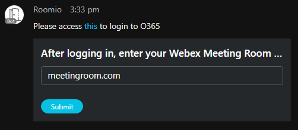
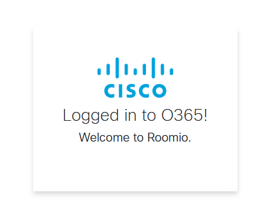
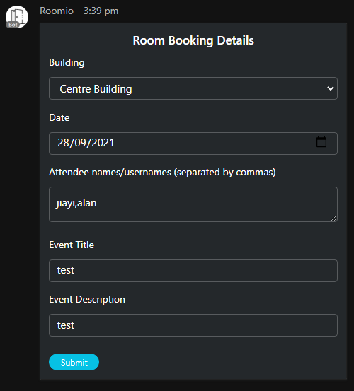
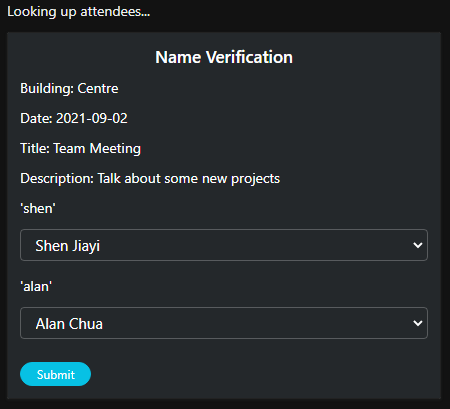
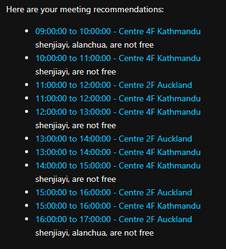
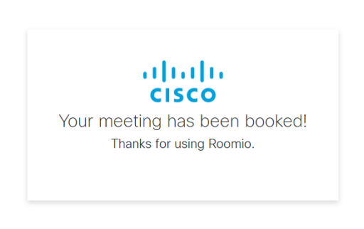
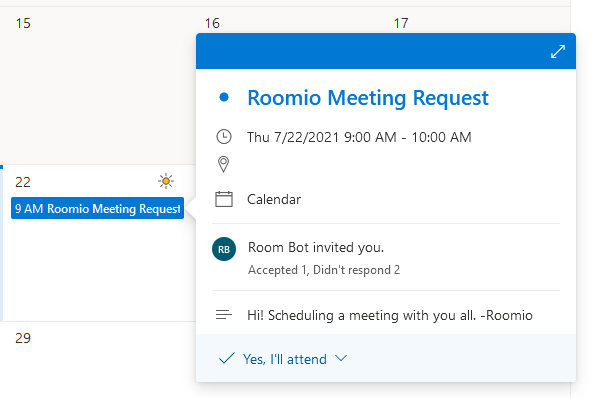

# Webex Room Booking Bot
This is the repo for the Webex Room Booking Bot.
The bot connects with Outlook and Office 365 to provide a way to easily book meeting rooms and webex meetings for teams.

## Contacts
* Josh Ingeniero (jingenie@cisco.com)

## Solution Components
* Webex Teams SDK
* Microsoft Graph API
* Microsoft Office 365
* Flask
* Python
* Docker

## Installation
### Python
#### Clone the repo
```console
git clone https://www.github.com/gve-sw/GVE_DevNet_Webex_Room_Booking_Bot
```

#### Set up a Python venv
First make sure that you have Python 3 installed on your machine. We will then be using venv to create
an isolated environment with only the necessary packages.

##### Install virtualenv via pip
```
$ pip install virtualenv
```

##### Create a new venv
```
Change to your project folder
$ cd GVE_DevNet_Webex_Room_Booking

Create the venv
$ virtualenv venv

Activate your venv
$ source venv/bin/activate
```

#### Install dependencies
```
$ pip install -r requirements.txt
```

## Setup
### Webex Bot
#### Bot Creation
You must create a Webex Bot using the Developer pages [here](https://developer.webex.com/docs/bots).
You would then obtain the Bot ID, Token, and Email which will be used for this application.

Fill in the details of your Webex Bot in the [DETAILS.py](roomio-server/DETAILS.py) file.
```python
# Webex Bot
BOT_ID = 'BOTID'
BOT_TOKEN = 'BOTTOKEN'
BOT_EMAIL = 'yourbotemail@webex.bot'
```

#### Connectivity
You need to expose the server bot publicly so Webex can send webhooks. You can do this with
ngrok, Heroku, Amazon Lightsail, or any other method.

By default, the flask server runs on port 5030. You may change this in [app.py](app.py):
```python
if __name__ == '__main__':
    app.run(host='0.0.0.0', port='5030', debug=True)
```

#### Webhook Setup
You need to set up two Webhooks:
* All Endpoint - For receiving any other events
* Card Endpoint - For receiving card-related information

Create the webhooks [here](https://developer.webex.com/docs/api/v1/webhooks/create-a-webhook) with the following details:
* All Endpoint
```
name: Roombot All
targetUrl: https://myexample.site.com/
resource: attachmentActions
event: created
```
* Card Endpoint
```
name: Roombot Card
targetUrl: https://myexample.site.com/card
resource: messages
event: all
```
These correspond to the _/_ and _/card_ endpoints of the flask server respectively.
You may refer to the Webex Developer guide on Webhooks [here](https://developer.webex.com/docs/api/guides/webhooks)
for more information.

#### Office 365 Setup
This bot prototype was developed using the Microsoft Office 365 Developer Program, using 
Office 365, Exchange Online, Azure Active Directory (AAD), and Microsoft Graph API's.
You would need to set up the following:
* Users to use the prototype
* Rooms for booking rooms - and setting up locations in [DETAILS.py](roomio-server/DETAILS.py)
* Azure Active Directory Application

To understand how this app uses Microsoft Graph and does actions on a user's behalf, please
refer to [this](https://docs.microsoft.com/en-us/graph/auth-v2-user) guide.

The app uses the following permissions on behalf of the logged in user (OAuth Scope):
* offline_access - for token generation
* calendars.readwrite.shared - for creating events on shared room calendars
* user.readbasic.all - for searching for usernames

You must create an application and register it on Azure Active Directory using [this](https://docs.microsoft.com/en-us/graph/auth-register-app-v2)
guide. You must use a Redirect URI which should hit the bot's ```graphCallback```
route. Fill in the details of your Application in the [DETAILS.py](roomio-server/DETAILS.py) file.

```python
ENDPOINT_URL = "https://myexample.site.com/"  # Where you are hosting your bot
AAD_ID = 'CLIENT ID'  # Your application's Client ID on AAD
AAD_SECRET = 'CLIENT SECRET'  # Your application's Client Secret on AAD
AAD_AUTHORITY = 'https://login.microsoftonline.com/YOURDOMAIN'  # Your organisation's domain login url
AAD_ENDPOINT = "https://graph.microsoft.com/v1.0/users/me"
AAD_CALLBACK = "https://myexample.site.com/graphCallback"  # Your Redirect URI
``` 

#### Room and Locations
Building options and locations must be configured
under locations in [DETAILS.py](roomio-server/DETAILS.py) and the ```location_list``` function
in [app.py](roomio-server/app.py). These rooms must be available in your Exchange deployment. A set of sample
rooms and buildings are provided.

#### Customising Meeting Booking
There are several options you can change to modify how the bot books a meeting. You may
find this in Fill in the [DETAILS.py](roomio-server/DETAILS.py) file.

More info can be found in the findMeetingTimes specification on Microsoft Graph [here](https://docs.microsoft.com/en-us/graph/api/user-findmeetingtimes?view=graph-rest-1.0&tabs=http).


```python
TIMEZONE = "Singapore Standard Time"  # Timezone for bookings
START_TIME = "T09:00:00"  # Default start time to search for meeting times
END_TIME = "T18:00:00"  # Default end time to search for meeting times
MEETING_DURATION = "PT1H"  # Default meeting duration - ISO8601 format
MAX_CANDIDATES = 10  # Max number of available options
MIN_PERCENTAGE = 50  # Minimum percentage of available attendees who must attend
```


## Usage

### Python

Launch the Webex Room Booking Bot. Make sure that you have your venv activated.
```commandline
$ cd roomio-server
$ python app.py
```


### Running
Initiate a chat with your bot using your bot's email address. You may type in a query cotaining one
of the following hot words to initiate a command:
* _book_ - Bring up the booking form
* 
#### Login
Your bot will initially ask you for login and meeting details.




#### Booking Form
Afterwards, you must enter the required info.


#### Name Confirmation
Names will then be confirmed in the next card.



#### Slot confirmation
You will then choose the desired slot, with the names of unavailable attendees listed.



Then, you will be redirected to a page and your meeting booked.





### LICENSE

Provided under Cisco Sample Code License, for details see [LICENSE](LICENSE.md)

### CODE OF CONDUCT

Our code of conduct is available [here](CODE_OF_CONDUCT.md)

### CONTRIBUTING

See our contributing guidelines [here](CONTRIBUTING.md)

#### DISCLAIMER:
**Please note:** This script is meant for demo purposes only. All tools/scripts in this repo are released for use "AS IS" without any warranties of any kind, including, but not limited to their installation, use, or performance. Any use of these scripts and tools is at your own risk. There is no guarantee that they have been through thorough testing in a comparable environment and we are not responsible for any damage or data loss incurred with their use.
You are responsible for reviewing and testing any scripts you run thoroughly before use in any non-testing environment.